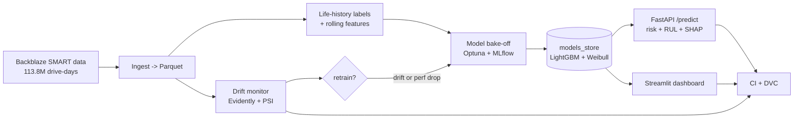

# DriveGuard

[](https://github.com/keerthirevanth/driveguard-predictive-maintenance/actions/workflows/ci.yml)

**Predictive maintenance for data-center hard drives** - predict which drives will fail,
estimate how much life they have left, and serve it as a monitored, self-healing ML system.
Built on **real production data** ([Backblaze Drive Stats](https://www.backblaze.com/cloud-storage/resources/hard-drive-test-data))
with an end-to-end MLOps stack.

Given a drive's recent SMART sensor readings, DriveGuard returns a calibrated **failure
probability**, an estimated **remaining useful life (RUL)** in days, and the **SHAP reasons**
behind the verdict.

---

## Why it is interesting

- **Real data, honest evaluation.** 113.8M daily SMART records from ~320k live drives.
  Time-based split (train on older quarters, test on the newest) so there is no leakage -
  many published results inflate scores with random splits; this one does not.
- **Extreme class imbalance done right.** Failures are ~0.004% of drive-days. Accuracy is
  meaningless (a "never fails" model scores 99.996%), so the project leads with PR-AUC,
  recall at a fixed false-alarm budget, calibration, and cost-sensitive thresholds.
- **Two framings, matched models.** Failure classification (LightGBM) and survival / RUL
  (7 models benchmarked). Different questions, different winners - chosen by evidence.
- **A production MLOps loop**, not just notebooks: serving API, drift monitoring with an
  auto-retrain trigger, model versioning, CI, and a dashboard.

## Headline results (held-out test quarter, 2025-Q3)

**Failure classification** - tuned LightGBM on rolling SMART features:

| Horizon | PR-AUC | Recall @ 1% false-alarm | Lift over base rate |
|---|---|---|---|
| 7-day  | 0.077 | 55.6% | ~265x |
| 15-day | 0.116 | 52.2% | ~193x |
| 30-day | 0.164 | 49.6% | ~135x |

**Remaining useful life** - 7 models benchmarked (concordance index = ranking quality):

| Model | C-index | RUL MAE (days) |
|---|---|---|
| Random Survival Forest | **0.712** | 94 |
| LSTM / 1D-CNN | 0.686 / 0.685 | 135 / 106 |
| DeepSurv | 0.662 | - |
| Weibull AFT | 0.630 | **58** |
| Cox PH | 0.455 | 123 |

Served models: **LightGBM** for failure risk, **Weibull AFT** for the days-remaining number
(best point estimate); RSF is cited as the strongest risk-ranker.

## Architecture



## The serving API

```bash
python -m driveguard.models.finalize      # train + save production models (local, ~3 min)
uvicorn driveguard.serving.app:app        # -> http://localhost:8000/docs
```

```jsonc
POST /predict
{ "model": "ST12000NM0007", "capacity_bytes": 12000000000000, "drive_age_days": 1600,
  "history": [ {"smart_5_raw": 40, "smart_197_raw": 20}, {"smart_5_raw": 220, "smart_197_raw": 120} ] }

-> { "failure_probability_30d": 0.52, "rul_days": 167, "alert_level": "warning",
     "confidence": "high", "models_agree": true, "top_reasons": [ ... ] }
```

Design touches worth noting: the raw classifier score is **isotonic-calibrated** into an
honest probability; alert thresholds come from **validation false-alarm budgets** (not an
arbitrary 0.5); and because the classifier and survival model are independent, the API
**detects and surfaces disagreement** (`models_agree`, `confidence`) instead of showing a
contradictory "critical + long RUL".

## Dashboard

```bash
streamlit run dashboard/app.py            # -> http://localhost:8501
```

Four views: **Predict a drive** (interactive, live model + SHAP), **Fleet health** (scores a
live sample of the newest quarter), **Drift monitor** (PSI report + retrain decision), and
**Model results**.

## MLOps loop

```bash
python -m driveguard.monitoring.drift     # PSI/KS + Evidently HTML drift report
python -m driveguard.pipelines.flows      # monitor -> decide -> conditional retrain
```

Drift is organic here: monitoring the newest quarter against training finds a real shift -
**5 new drive models entered the fleet** - while confirming the failure-signal features are
stable, so no needless retrain fires. Models are versioned with **DVC**; **GitHub Actions**
runs lint + tests (including a job that exercises the serving app).

## Tech stack

Python, Polars + Parquet, scikit-learn, LightGBM/XGBoost/CatBoost, PyTorch,
lifelines/scikit-survival, Optuna, MLflow, Evidently, DVC, FastAPI, Docker, Streamlit,
GitHub Actions.

## Repository layout

```
src/driveguard/
  data/         ingest, life-history labels, EDA
  features/     rolling features, survival + sequence datasets
  models/       bake-off, HPO, survival, sequence RUL, finalize (train+save)
  evaluation/   imbalance-aware + survival metrics
  serving/      FastAPI app (calibrated, reconciled, SHAP)
  monitoring/   drift detection, retrain trigger, fleet scoring
  pipelines/    Prefect-optional MLOps flow
dashboard/      Streamlit app
notebooks/      Kaggle GPU experiment notebooks (archived)
reports/        results tables, EDA figures, drift report
docker/         serving image
```

## Reproduce locally

```bash
pip install -r requirements.txt
python -m driveguard.data.ingest          # Backblaze zips -> Parquet
python -m driveguard.data.life_history     # labels + drive summary
python -m driveguard.models.finalize       # train + save production models
uvicorn driveguard.serving.app:app         # serve
```

Model experiments (the bake-off / HPO / survival / sequence models) were run on Kaggle GPUs;
the notebooks are in `notebooks/`, and the numeric results they produced are in `reports/`.

## Data license

Data (c) Backblaze, used under their
[terms](https://www.backblaze.com/cloud-storage/resources/hard-drive-test-data): free with
attribution. Raw data is not redistributed in this repository.
